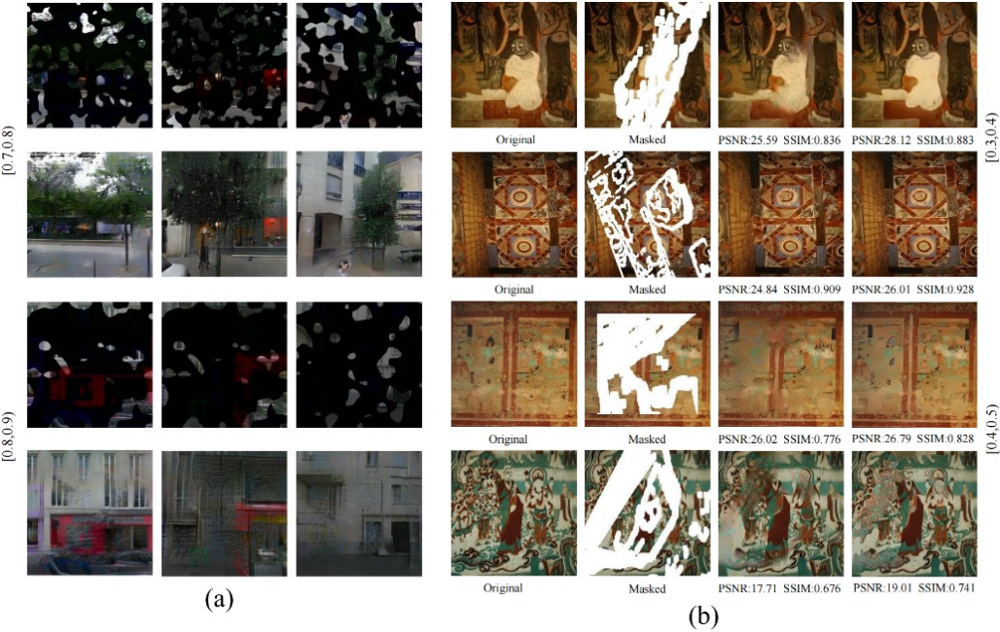

# Inp-JSRDiff: Image Inpainting via Jointing Structure Restoration and End-to-end Reversible Diffusion

<div align="center">

**Few-step diffusion inpainting with joint structure restoration, multi-level prior injection, and reversible feature reconstruction**

[Overview](#overview) · [Method](#method-at-a-glance) · [Repository](#repository-contents) · [Checkpoints](#pre-trained-checkpoints) · [Cross-domain Evaluation](#cross-domain-generalization) · [Acknowledgements](#acknowledgements)

</div>

---

## Overview

Inp-JSRDiff is an image inpainting framework designed for **large and irregular missing regions**. The method reformulates deterministic diffusion sampling as a **few-step reconstruction process** and jointly optimizes structural restoration and image reconstruction in a connected computational graph.

The framework contains three main components:

- **E-StructRM** restores a structural edge prior from the corrupted image, visible edges, and mask.
- **RevDiffInpaint** performs few-step reconstruction with hard known-pixel consistency.
- **CADI** is a task-specific structural and consistency prior injector. Built upon channel-wise feature modulation, it jointly integrates restored edge priors, observed-image texture anchors, and known-region cues into multiple levels of the diffusion backbone.

Reversible feature reconstruction is further used to reduce peak training-memory consumption during end-to-end optimization. The reduction in total inference cost mainly comes from using very few reconstruction steps rather than from a lighter single step.

### Main characteristics

- **Few-step reconstruction-oriented diffusion** for large-mask image inpainting.
- **Hard known-pixel consistency** during reconstruction.
- **Joint structure–texture optimization** between edge restoration and image reconstruction.
- **Multi-source, multi-level prior injection with CADI**.
- **Reversible feature reconstruction** for memory-efficient end-to-end training.
- Evaluation in the paper on **CelebA-HQ, Places2, and Paris StreetView**, with SSIM, PSNR, L1, LPIPS, and FID.

---

## Method at a Glance

```text
Masked image + mask
        │
        ├──────────────► E-StructRM ─────────────► restored edge prior
        │                                             │
        ▼                                             ▼
measurement-conditioned state                  CADI prior injection
        │                                             │
        └──────────────► RevDiffInpaint ◄─────────────┘
                              │
                    denoise → clamp → update
                              │
                       few reconstruction steps
                              │
                              ▼
                       inpainted image
```

### CADI

CADI uses established channel-wise feature modulation as the underlying operation, while adapting it to the inpainting problem by jointly fusing four complementary sources:

1. backbone features,
2. known-region feature responses,
3. observed-image texture anchors, and
4. restored structural edge priors.

These cues are injected at multiple levels of the diffusion backbone rather than only through shallow input concatenation.

### Reversible reconstruction

The reversible design reconstructs intermediate states during backpropagation instead of storing the full set of activations. This introduces a memory–computation trade-off: peak training memory is reduced at the cost of additional recomputation.

---

## Repository Contents

This repository currently provides the **core implementation of the proposed architecture**.

| File | Description |
|---|---|
| `model.py` | RevDiffInpaint, CADI-style injector, reconstruction steps, and pruned SD-v1.5 U-Net integration |
| `networks.py` | E-StructRM-related networks, discriminator, attention blocks, and VGG feature extractor |
| `backprop.py` | Reversible modules and custom reversible backpropagation |
| `forward.py` | Modified forward functions for the pruned diffusion U-Net |
| `utils.py` | Utility functions including image transforms and PSNR computation |

> **Note:** This snapshot focuses on the core model implementation used to describe and inspect the proposed architecture. Please use the released checkpoints below together with the corresponding data preprocessing and evaluation protocol described in the manuscript.

---

## Environment

The implementation is based on PyTorch and Hugging Face Diffusers. The core files depend on packages including:

```bash
pip install torch torchvision diffusers numpy mamba-ssm
```

A CUDA-capable GPU is recommended for model execution.

---

## Pre-trained Checkpoints

Pre-trained model weights are available from **Baidu NetDisk**:

- [Download checkpoints](https://pan.baidu.com/s/1I6QLQFyQhnG1E1YHwrT1Vw)
- Extraction code: `fajm`

The released model is built around a pruned Stable Diffusion v1.5 U-Net and the structural restoration branch described in the manuscript.

---

## Evaluation Protocol

The paper evaluates Inp-JSRDiff on:

- **CelebA-HQ**
- **Places2**
- **Paris StreetView (PSV)**

Irregular masks are evaluated over multiple missing-area ranges, with particular emphasis on large missing regions. The reported metrics include **SSIM, PSNR, L1, LPIPS, and FID**.

The manuscript also studies reconstruction-step behavior, reversible-vs.-non-reversible training, different prior-injection strategies, structural-prior quality, and end-to-end structure–texture coupling.

---

## Cross-domain Generalization

To provide additional evidence on transferability beyond the three primary benchmarks, we evaluate a checkpoint trained on **CelebA-HQ** on the **Dunhuang Mural Dataset**, whose visual distribution differs substantially from facial imagery. We report results both **without fine-tuning** and **after fine-tuning** on the target domain.

### Quantitative results

| Metric | Setting | [0.01, 0.1) | [0.1, 0.2) | [0.2, 0.3) | [0.3, 0.4) | [0.4, 0.5) | [0.5, 0.6) |
|---|---|---:|---:|---:|---:|---:|---:|
| SSIM ↑ | No fine-tuning | 0.980 | 0.940 | 0.885 | 0.814 | 0.728 | 0.583 |
|  | Fine-tuning | **0.989** | **0.950** | **0.912** | **0.827** | **0.768** | **0.682** |
| PSNR ↑ | No fine-tuning | 33.34 | 27.92 | 25.00 | 22.96 | 21.32 | 19.48 |
|  | Fine-tuning | **34.34** | **32.32** | **29.76** | **25.46** | **23.84** | **21.48** |
| L1 (10⁻²) ↓ | No fine-tuning | 0.91 | 1.83 | 2.99 | 4.29 | 5.78 | 8.05 |
|  | Fine-tuning | **0.36** | **1.03** | **1.89** | **3.69** | **4.28** | **6.05** |
| LPIPS ↓ | No fine-tuning | 0.025 | 0.066 | 0.113 | 0.163 | 0.217 | 0.298 |
|  | Fine-tuning | **0.015** | **0.056** | **0.103** | **0.133** | **0.167** | **0.227** |
| FID ↓ | No fine-tuning | 6.08 | 18.39 | 35.64 | 54.22 | 75.16 | 97.37 |
|  | Fine-tuning | **4.08** | **8.32** | **13.54** | **26.43** | **34.51** | **46.83** |

Fine-tuning improves all five metrics across all reported mask ranges. Under the large-mask setting **[0.5, 0.6)**, PSNR improves from **19.48 dB to 21.48 dB**, SSIM from **0.583 to 0.682**, LPIPS decreases from **0.298 to 0.227**, and FID decreases from **97.37 to 46.83**. The no-fine-tuning results are also reported to make the cross-domain behavior directly inspectable rather than relying only on the adapted model.

### Qualitative results

The figure below contains the supporting qualitative comparison. The Dunhuang examples show, from left to right, the original image, masked input, reconstruction without fine-tuning, and reconstruction after fine-tuning. The left part of the figure additionally illustrates extreme high-porosity examples on PSV.

<p align="center">
  
</p>


These additional results are provided here to make the cross-domain evidence directly accessible alongside the released code while keeping the main manuscript within the journal page limit.

---

## Notes on Reproducibility

- The model uses a **pruned Stable Diffusion v1.5 U-Net** as the reconstruction backbone.
- The structural branch receives grayscale/image-structure information and predicts an edge prior used by CADI.
- The mask convention in the manuscript is **1 for missing pixels and 0 for known pixels**.
- Known pixels are explicitly preserved during reconstruction through a hard consistency projection.
- Reconstruction step number `T` controls the fidelity–perception / efficiency trade-off analyzed in the paper.

---

## Acknowledgements

This implementation builds on ideas and software from several open-source projects, including:

- [Invertible Diffusion Models for Compressed Sensing (IDM)](https://github.com/Guaishou74851/IDM.git)
- [Hugging Face Diffusers](https://github.com/huggingface/diffusers)
- [EdgeConnect](https://github.com/knazeri/edge-connect)

We thank the authors and maintainers of these projects for making their work publicly available.

---

## Contact

For questions about the implementation or experimental protocol, please open an issue in this repository.

If this project is useful for your research, a star is appreciated.
